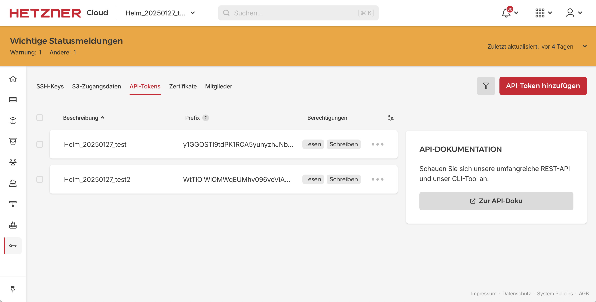

# course-vms

## copy a read-write authentication token

Get access to a hetzner cloud project. For a Linuxhotel training, please ask the office.

Replace ${context} and go to: https://console.hetzner.cloud/projects/${context}/security/tokens

## edit configuration for the course

* `cp hetzner_vm_create.conf.template hetzner_vm_create.conf`
* `edit hetzner_vm_create.conf`
  * change the value of `context` to the name of the project at hetzner
  * change the value of `users` to a quoted list of usernames for the participants and the trainers
  * add your username to the list of `admins`
  * customize the other variables to your needs

## run hetzner_vm_create

`./hetzner_vm_create`

at first run for a new course you have to enter the authentication token

## optional: DNS

add records from `${context}.zone` to DNS

## configure VMs with ansible

`source hetzner_vm_create.conf`

test ssh access to one VM:

`ssh -o UserKnownHostsFile=${context}.known_hosts root@${ip} hostname`

Test ansible access to all VMs:

`ansible -u root -i ${context}.inventory $context -a 'hostname'`

Run a playbook for your course:

`ansible-playbook -u root -i ${context}.inventory ${course}.yml`

optional: see debug facts

`ansible-playbook -u root -i ${context}.inventory ${course}.yml -t debug_info | more`

## docker

```shell
docker build -t hcloud .
docker run -it --rm -v ~/.ssh/id_linuxhotel_ed25519:/root/.ssh/id_ed25519 -v $(pwd):/root/app -w /root/app hcloud /bin/bash
eval ssh-agent &
export SSH_AUTH_SOCK=/tmp/ssh-9U374MXH4sgb/agent.8 
ssh-add ~/.ssh/id_ed25519
./hetzner_vm_create
# TOKEN via Hetzner Condole besorgen!!
ansible-playbook -u root -i Helm_20250127_test.inventory helm.yml
ssh root@<ip>
kubectl get nodes
exit
exit
```

## API TOKEN

 
